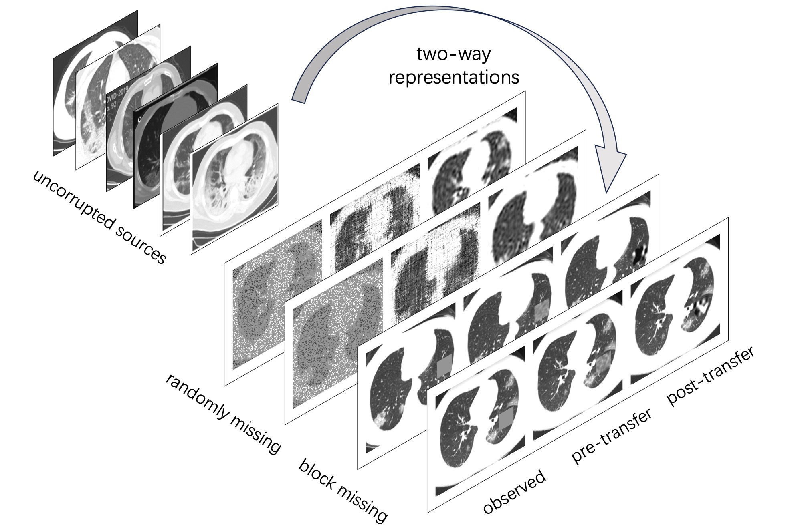

# TransMC
Here provides the codes to reproduce the numerical experiments in the paper "Two-Way Representational Transfer Learning for Noisy Matrix Completion". 

## Summary

A two-way representational transfer learning framework is introduced for matrix completion, which leverages column and row subspace similarity from a large number of available source datasets, in contrast to the commonly used distance similarity in the literature. The proposed approach transforms the original high-dimensional matrix completion task into a simple, lower-dimensional regression problem, thereby greatly enhancing statistical efficiency.

<p align="center">
  
</p>


## Citation

```
@article{2024Representational,
  title={Two-way Representational Transfer Learning for Matrix Completion},
  author={ He, Yong  and  Li, Zeyu  and  Liu, Dong  and  Qin, Kangxiang  and  Xie, Jiahui },
  year={2024},
}
```
